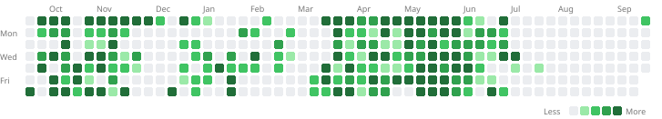

# My LeetCode Solutions

> Auto-synced by [LeetPush](https://github.com/adarshsahu1077/leetpush)

## Activity

## Stats

## Progress

| Difficulty | Solved | Bar |
|:-----------|-------:|:----|
| Easy       | 5   | `█████░░░░░░░░░░░░░░░` |
| Medium     | 8 | `████████░░░░░░░░░░░░` |
| Hard       | 6   | `██████░░░░░░░░░░░░░░` |

## By Topic

| Topic | Count |
|:------|------:|
| Array | 6 |
| Hash Table | 4 |
| String | 4 |
| Sliding Window | 4 |
| Stack | 2 |
| Monotonic Stack | 2 |
| Dynamic Programming | 2 |
| Linked List | 2 |
| Recursion | 2 |
| Prefix Sum | 1 |
| Sorting | 1 |
| Queue | 1 |
| Heap (Priority Queue) | 1 |
| Monotonic Queue | 1 |
| Binary Search | 1 |
| Divide and Conquer | 1 |
| Matrix | 1 |
## Recently Solved

| # | Problem | Difficulty | Languages | Solved |
|---|:--------|:----------:|:----------|:-------|
| 3408 | [Count the Number of Special Characters I](solutions/hash-table/easy/3408-count-the-number-of-special-characters-i) | Easy | python3 | 2026-05-26 |
| 739 | [Daily Temperatures](solutions/array/medium/0739-daily-temperatures) | Medium | python3 | 2026-05-25 |
| 496 | [Next Greater Element I](solutions/array/easy/0496-next-greater-element-i) | Easy | python3 | 2026-05-25 |
| 2001 | [Jump Game VII](solutions/string/medium/2001-jump-game-vii) | Medium | python3 | 2026-05-25 |
| 1466 | [Jump Game V](solutions/array/hard/1466-jump-game-v) | Hard | python3 | 2026-05-25 |
| 4076 | [Number of Pairs After Increment](solutions/uncategorized/hard/4076-number-of-pairs-after-increment) | Hard | python3 | 2026-05-24 |
| 4184 | [Minimum Operations to Sort a Permutation](solutions/uncategorized/medium/4184-minimum-operations-to-sort-a-permutation) | Medium | python3 | 2026-05-24 |
| 4313 | [Password Strength](solutions/uncategorized/medium/4313-password-strength) | Medium | python3 | 2026-05-24 |
| 4312 | [Limit Occurrences in Sorted Array](solutions/uncategorized/easy/4312-limit-occurrences-in-sorted-array) | Easy | python3 | 2026-05-24 |
| 4300 | [Minimum Operations to Make Array Modulo Alternating I](solutions/uncategorized/medium/4300-minimum-operations-to-make-array-modulo-alternating-i) | Medium | python3 | 2026-05-23 |
---

*Last synced: 2026-05-26T15:02:20Z*
